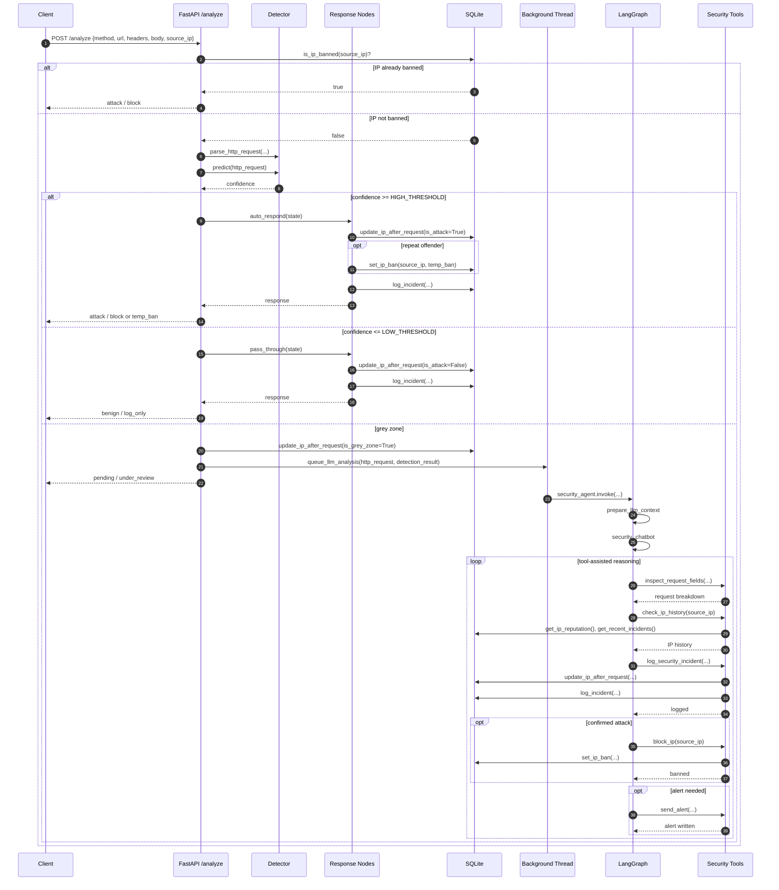

# Default API-Led Architecture Sequence Diagram

```mermaid
sequenceDiagram
    autonumber
    participant C as Client
    participant A as FastAPI /analyze
    participant D as Detector
    participant R as Response Nodes
    participant DB as SQLite
    participant B as Background Thread
    participant G as LangGraph
    participant T as Security Tools

    C->>A: POST /analyze {method, url, headers, body, source_ip}
    A->>DB: is_ip_banned(source_ip)?

    alt IP already banned
        DB-->>A: true
        A-->>C: attack / block
    else IP not banned
        DB-->>A: false
        A->>D: parse_http_request(...)
        A->>D: predict(http_request)
        D-->>A: confidence

        alt confidence >= HIGH_THRESHOLD
            A->>R: auto_respond(state)
            R->>DB: update_ip_after_request(is_attack=True)
            opt repeat offender
                R->>DB: set_ip_ban(source_ip, temp_ban)
            end
            R->>DB: log_incident(...)
            R-->>A: response
            A-->>C: attack / block or temp_ban

        else confidence <= LOW_THRESHOLD
            A->>R: pass_through(state)
            R->>DB: update_ip_after_request(is_attack=False)
            R->>DB: log_incident(...)
            R-->>A: response
            A-->>C: benign / log_only

        else grey zone
            A->>DB: update_ip_after_request(is_grey_zone=True)
            A->>B: queue_llm_analysis(http_request, detection_result)
            A-->>C: pending / under_review

            B->>G: security_agent.invoke(...)
            G->>G: prepare_llm_context
            G->>G: security_chatbot

            loop tool-assisted reasoning
                G->>T: inspect_request_fields(...)
                T-->>G: request breakdown
                G->>T: check_ip_history(source_ip)
                T->>DB: get_ip_reputation(), get_recent_incidents()
                T-->>G: IP history
                G->>T: log_security_incident(...)
                T->>DB: update_ip_after_request(...)
                T->>DB: log_incident(...)
                T-->>G: logged
                opt confirmed attack
                    G->>T: block_ip(source_ip)
                    T->>DB: set_ip_ban(...)
                    T-->>G: banned
                end
                opt alert needed
                    G->>T: send_alert(...)
                    T-->>G: alert written
                end
            end
        end
    end
```
