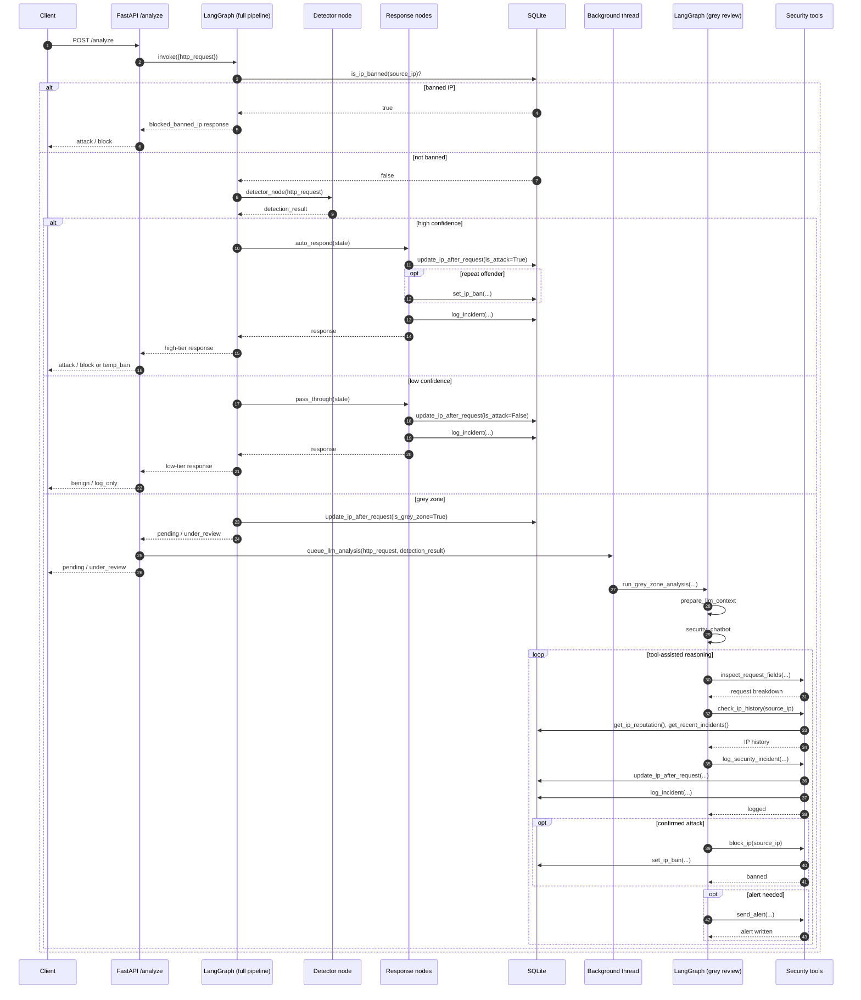

# Full LangGraph Variant Sequence Diagram

Default experimental data path:
- `output/full_graph/security_full_graph.db`

```mermaid
sequenceDiagram
    autonumber
    participant C as Client
    participant A as FastAPI /analyze
    participant G as LangGraph (full pipeline)
    participant D as Detector node
    participant R as Response nodes
    participant DB as SQLite
    participant B as Background thread
    participant LG as LangGraph (grey review)
    participant T as Security tools

    C->>A: POST /analyze
    A->>G: invoke({http_request})

    G->>DB: is_ip_banned(source_ip)?
    alt banned IP
        DB-->>G: true
        G-->>A: blocked_banned_ip response
        A-->>C: attack / block
    else not banned
        DB-->>G: false
        G->>D: detector_node(http_request)
        D-->>G: detection_result

        alt high confidence
            G->>R: auto_respond(state)
            R->>DB: update_ip_after_request(is_attack=True)
            opt repeat offender
                R->>DB: set_ip_ban(...)
            end
            R->>DB: log_incident(...)
            R-->>G: response
            G-->>A: high-tier response
            A-->>C: attack / block or temp_ban

        else low confidence
            G->>R: pass_through(state)
            R->>DB: update_ip_after_request(is_attack=False)
            R->>DB: log_incident(...)
            R-->>G: response
            G-->>A: low-tier response
            A-->>C: benign / log_only

        else grey zone
            G->>DB: update_ip_after_request(is_grey_zone=True)
            G-->>A: pending / under_review
            A->>B: queue_llm_analysis(http_request, detection_result)
            A-->>C: pending / under_review

            B->>LG: run_grey_zone_analysis(...)
            LG->>LG: prepare_llm_context
            LG->>LG: security_chatbot

            loop tool-assisted reasoning
                LG->>T: inspect_request_fields(...)
                T-->>LG: request breakdown
                LG->>T: check_ip_history(source_ip)
                T->>DB: get_ip_reputation(), get_recent_incidents()
                T-->>LG: IP history
                LG->>T: log_security_incident(...)
                T->>DB: update_ip_after_request(...)
                T->>DB: log_incident(...)
                T-->>LG: logged
                opt confirmed attack
                    LG->>T: block_ip(source_ip)
                    T->>DB: set_ip_ban(...)
                    T-->>LG: banned
                end
                opt alert needed
                    LG->>T: send_alert(...)
                    T-->>LG: alert written
                end
            end
        end
    end
```
